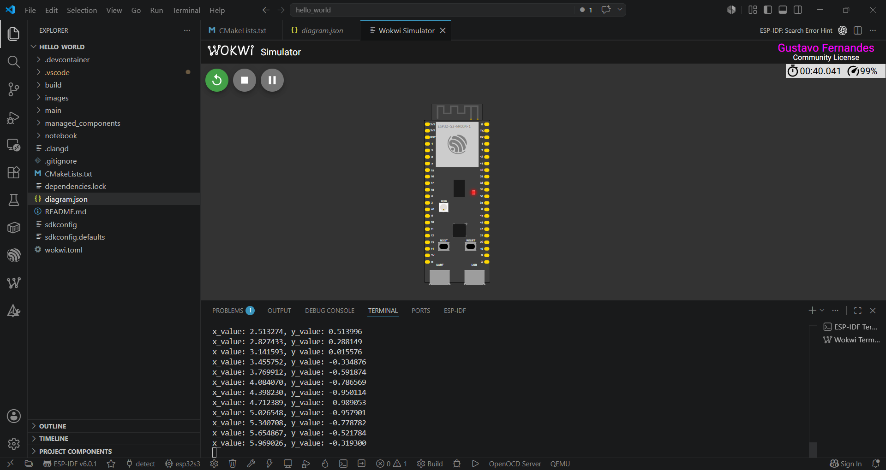

# Relatorio de Atividade Pratica: IA Embarcada e Modelos Compactos

**Disciplina:** Inteligencia Artificial Aplicada  
**Estudante:** Gustavo Fernandes  
**Projeto:** TensorFlow Lite Micro - Hello World no ESP32-S3

## 1. Reproducao dos passos do Hello World

O repositorio implementa o exemplo `Hello World` do TensorFlow Lite Micro no ESP32-S3 usando ESP-IDF e simulacao no Wokwi. O fluxo observado no projeto foi o seguinte:

1. Treinamento do modelo para aproximar a funcao `y = sen(x)` em um notebook.
   O diretorio `notebooks/` contem os artefatos relacionados ao modelo.
2. Conversao do modelo `.tflite` para um array C/C++ compilavel, representado no projeto por [model.cc](C:/Projetos/hello_world_tflite-main/hello_world/main/model.cc).
3. Inclusao do runtime embarcado com a dependencia `espressif/esp-tflite-micro`, declarada em [idf_component.yml](C:/Projetos/hello_world_tflite-main/hello_world/main/idf_component.yml).
4. Registro dos arquivos principais no build em [main/CMakeLists.txt](C:/Projetos/hello_world_tflite-main/hello_world/main/CMakeLists.txt), incluindo `main.cc`, `main_functions.cc`, `constants.cc`, `output_handler.cc` e `model.cc`.
5. Geracao do firmware do ESP32-S3 com `idf.py build`.
6. Simulacao no Wokwi com os arquivos [diagram.json](C:/Projetos/hello_world_tflite-main/hello_world/diagram.json) e [wokwi.toml](C:/Projetos/hello_world_tflite-main/hello_world/wokwi.toml), que apontam para a placa `ESP32-S3-DevKitC-1` e para os binarios gerados em `build/`.

### Comandos de reproducao

```bash
idf.py set-target esp32s3
idf.py build
```

Para executar no simulador Wokwi, o projeto usa:

- `diagram.json` para definir a placa e o monitor serial.
- `wokwi.toml` para mapear `build/hello_world.bin` e `build/hello_world.elf`.

## 2. Print da tela do Wokwi rodando o Hello World

A captura de tela da simulacao foi adicionada abaixo a partir da pasta `assets`:



## 3. Analise do codigo e da documentacao

### Observacoes tecnicas

- O arquivo `main/main_functions.cc` concentra a inicializacao do modelo, a alocacao da `tensor_arena`, a quantizacao da entrada e a dequantizacao da saida.
- A inferencia usa `tflite::MicroInterpreter`, abordagem adequada para microcontroladores por evitar dependencias pesadas e trabalhar com memoria estatica.
- O projeto registra somente a operacao `FullyConnected` em `MicroMutableOpResolver<1>`, o que reduz o tamanho do binario final e e uma boa pratica em IA embarcada.
- A `tensor_arena` foi definida com `2000` bytes. Esse valor funciona para o exemplo, mas e um ponto sensivel em sistemas embarcados: qualquer troca de modelo ou operador pode exigir reavaliacao de memoria.
- A entrada e a saida usam quantizacao `int8`, reduzindo uso de memoria e custo computacional em relacao a `float32`, com pequeno impacto de precisao quando comparado ao beneficio em dispositivos restritos.
- A funcao `HandleOutput` em `main/output_handler.cc` envia os pares `x` e `y` para o monitor serial com `MicroPrintf`, o que simplifica a validacao no Wokwi.
- O `diagram.json` esta enxuto e suficiente para a simulacao, conectando apenas a UART ao monitor serial. Isso e coerente com o objetivo didatico do exemplo.

### Pontos de atencao

- O `README` anterior estava com problema de codificacao de caracteres. Isso foi corrigido nesta versao para facilitar leitura e manutencao.
- O repositorio foi inicializado com git nesta pasta, entao os arquivos ja estao prontos para versionamento local.
- Nao encontrei, neste turno, um log de execucao salvo em arquivo dentro do repositorio. A validacao visual fica representada pela captura da simulacao em `assets/Captura_tela_simulacao.png`.

## Conclusao

O projeto demonstra corretamente um fluxo classico de IA embarcada: modelo pequeno, inferencia local, uso de memoria estatica e integracao com um ambiente de simulacao para validar o comportamento sem hardware fisico. Como base academica e didatica, a estrutura esta adequada e evidencia bem as restricoes e decisoes tipicas de TinyML no ESP32-S3.
